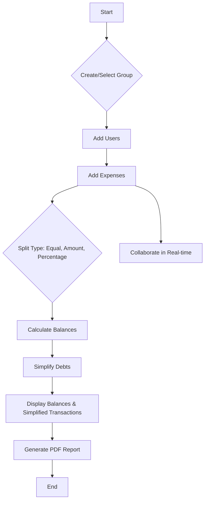

# 💸 Splitter: Expense Splitter and Debt Simplifier

Splitter is a powerful and intuitive web application designed to simplify group expense management and streamline debt settlement. Whether you're sharing costs with roommates, planning a trip with friends, or managing team expenses, Splitter helps you track who paid what, who owes whom, and then intelligently simplifies the transactions to minimize the number of payments needed.

## ✨ Features

*   **Group Management:** Create and manage multiple expense groups for different events or circles. 👥
*   **User Management:** Easily add and remove participants within each group. ➕➖
*   **Expense Tracking:** Record expenses with details like title, amount, payers, and participants. Supports various split types (equal, by amount, by percentage). 📝
*   **Real-time Collaboration:** Share your expense groups with others and collaborate in real-time using PeerJS. 🤝
*   **Debt Simplification:** Automatically calculates and simplifies debts, showing the fewest transactions required to settle up, powered by a custom debt simplification algorithm. 🧮
*   **Balance Summary:** Get a clear overview of each user's balance within a group. 📊
*   **PDF Report Generation:** Download a comprehensive PDF report of your group's expenses, balances, and simplified transactions using jsPDF and html2canvas. 📄
*   **Local Storage Persistence:** All your data is saved locally in your browser, ensuring your groups and expenses are available even after you close the tab. 💾

## 🛠️ How It Works

Splitter operates on a simple yet effective principle: track all expenses, calculate individual balances, and then simplify the overall debt structure.

1.  **Expense Input:** Users add expenses, specifying who paid and who participated, along with the amount and split type.
2.  **Balance Calculation:** The application calculates the net balance for each user in a group (who owes whom).
3.  **Debt Simplification:** A custom algorithm (located in `utils/debtSimplifier.ts`) processes these balances to determine the minimum number of transactions required to settle all debts. For example, if A owes B $10 and B owes C $10, the system will suggest A pays C $10 directly, eliminating B as an intermediary.
4.  **Real-time Updates:** With PeerJS, group data can be synchronized across multiple devices in real-time, allowing for collaborative expense tracking.



## 🚀 Technologies Used

*   **React:** A JavaScript library for building user interfaces. ⚛️
*   **TypeScript:** A typed superset of JavaScript that compiles to plain JavaScript. 🟦
*   **Vite:** A fast build tool that provides a lightning-fast development experience. ⚡
*   **PeerJS:** For real-time peer-to-peer collaboration. 🔗
*   **jsPDF & html2canvas:** For client-side PDF generation. 📄
*   **Tailwind CSS:** For rapid UI development and styling. 🎨

## 💻 Run Locally

**Prerequisites:** Node.js (LTS version recommended)

1.  **Clone the repository:**
    ```bash
    git clone https://github.com/sagarmemane135/Splitter.git
    cd Splitter
    ```
2.  **Install dependencies:**
    ```bash
    npm install
    ```
3.  **Run the app in development mode:**
    ```bash
    npm run dev
    ```
    The application will be available at `http://localhost:5173` (or another port if 5173 is in use).

## ☁️ Deployment

This project uses `gh-pages` for deployment to GitHub Pages. 🚀

1.  **Build the project:**
    ```bash
    npm run build
    ```
2.  **Deploy to GitHub Pages:**
    ```bash
    npm run deploy
    ```
    Your application will be deployed to `https://sagarmemane135.github.io/Splitter/`.

## 🔄 GitHub CI/CD

A GitHub Actions workflow is configured to automatically build and deploy the application to GitHub Pages whenever changes are pushed to the `main` branch. 🤖

## 💡 Future Enhancements

*   **Authentication:** Implement user authentication to secure groups and personal data.
*   **Cloud Storage:** Integrate with a backend service for cloud storage of group data, allowing access across devices and preventing data loss.
*   **Currency Support:** Add support for multiple currencies and exchange rates.
*   **Recurring Expenses:** Feature to handle recurring expenses automatically.
*   **Notifications:** Implement notifications for new expenses, comments, or collaboration requests.
*   **Improved UI/UX:** Further refine the user interface and experience for even greater ease of use.

## 🔗 Repository

[https://github.com/sagarmemane135/Splitter/](https://github.com/sagarmemane135/Splitter/)
